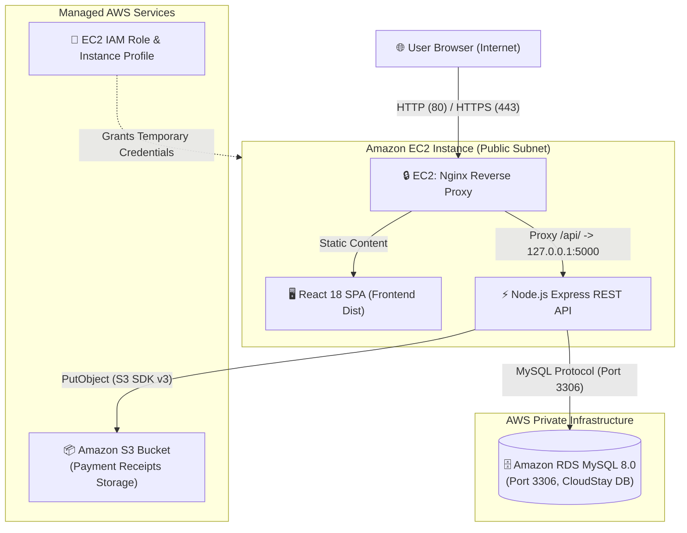
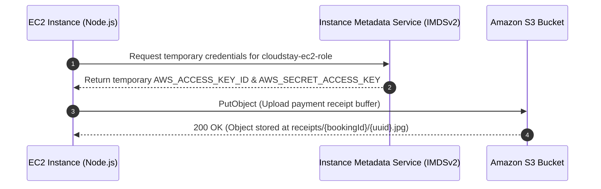

# CloudStay — AWS Architecture & Network Security Map

This document defines the complete system map, network flow, and security boundaries for deploying the **CloudStay Hostel Booking System** on Amazon Web Services (AWS).

---

## 1. System Components Overview

CloudStay consists of three primary application tiers and two AWS managed services:

| Component | Technology | Local Environment | AWS Production Environment |
|---|---|---|---|
| **Frontend** | React 18, Vite, React Router | Vite dev server / Nginx container (port 5173/80) | Nginx on EC2 serving static bundle or Dockerized Nginx |
| **Backend API** | Node.js (>=18), Express, JWT, bcryptjs | Node process / Docker container (port 5000) | Express REST API on EC2 (PM2 cluster or Docker) |
| **Database** | MySQL 8.0 (Schema, Procedures, Triggers, Views) | MySQL 8.0 Docker container (port 3306) | Amazon RDS for MySQL 8.0 (Multi-AZ optional) |
| **File Storage** | AWS S3 SDK (`@aws-sdk/client-s3`) | Mocked / Blank S3 environment | Amazon S3 Bucket (`cloudstay-receipts`) |
| **Identity & Security** | IAM Role & Instance Profile | Local environment variables | EC2 IAM Role (`cloudstay-ec2-role`) |

---

## 2. Local vs. AWS System Flow

### Local Development Flow
```
[User Browser]
      │
      ├── GET http://localhost:5173 ───────► [Frontend Container / Nginx]
      │
      └── API http://localhost:5000/api ──► [Backend Container / Express]
                                                  │
                                                  ▼ (DB_HOST=mysql:3306)
                                            [MySQL Container]
```

### AWS Production Flow
```
[User Browser]
      │
      │ HTTPS (Port 443) / HTTP (Port 80)
      ▼
┌─────────────────────────────────────────────────────────────────────────────┐
│  VPC: Public Subnet                                                         │
│                                                                             │
│  [EC2 Instance: cloudstay-server]                                           │
│  │                                                                          │
│  ├── Nginx (Reverse Proxy & Static Web Server)                             │
│  │     ├── Serves React Static Bundle (/var/www/CloudStay/frontend/dist)     │
│  │     └── Proxies /api/ ──────────────────┐                              │
│  │                                        ▼                                 │
│  └── Backend API Container (Express REST API on 127.0.0.1:5000)             │
│        │                                                                    │
└────────┼──────────────────────────────────┼─────────────────────────────────┘
         │                                  │
         │ MySQL (Port 3306)                │ IAM Role Authentication & PutObject
         ▼                                  ▼
┌──────────────────────────────┐   ┌──────────────────────────────────────────┐
│ VPC: Private Subnet          │   │ Amazon S3                                │
│                              │   │                                          │
│ [Amazon RDS MySQL 8.0]       │   │ [Bucket: cloudstay-receipts-yourname]    │
│  (Database: cloudstay)       │   │  Path: receipts/{bookingId}/{uuid}.jpg   │
└──────────────────────────────┘   └──────────────────────────────────────────┘
```

---

## 3. Architecture Diagrams (Mermaid)

### Primary System Architecture


### IAM Security Boundary & Role Flow


---

## 4. Port and Interface Mapping

| Interface | Internal Port | External Port | Exposure Level | Description |
|---|---|---|---|---|
| Nginx Web Server | 80 / 443 | 80 / 443 | **Public** | Listens for user web traffic & API requests |
| Backend Express API | 5000 | 127.0.0.1:5000 | **Localhost Only** | Node server process running behind Nginx proxy |
| RDS MySQL | 3306 | 3306 (VPC Internal) | **Private Subnet** | Inbound restricted strictly to `cloudstay-ec2-sg` |
| SSH Management | 22 | 22 | **Restricted** | Admin access restricted to authorized developer IP |

---

## 5. Network Security Boundaries

1. **Public Boundary**:
   - Only Ports 80 (HTTP) and 443 (HTTPS) are exposed to `0.0.0.0/0`.
   - Port 22 (SSH) is strictly bound to your specific administrative IP (`/32`).

2. **Application Boundary**:
   - Backend Express API binds to `127.0.0.1:5000` or internal Docker bridge networks. It is **never** directly exposed to the internet.
   - Nginx handles TLS termination, request filtering, and proxying.

3. **Database Boundary**:
   - RDS MySQL instance lives in a Private Subnet (or has `Publicly Accessible: No`).
   - The Security Group `cloudstay-rds-sg` only permits TCP port 3306 traffic originating from `cloudstay-ec2-sg` (Security Group reference matching).
