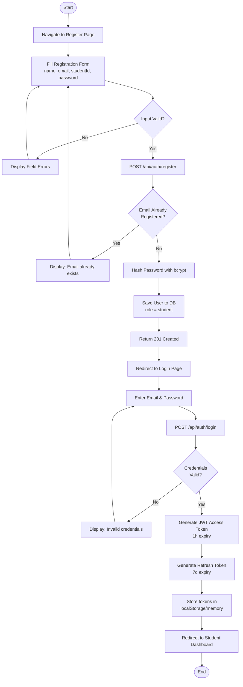
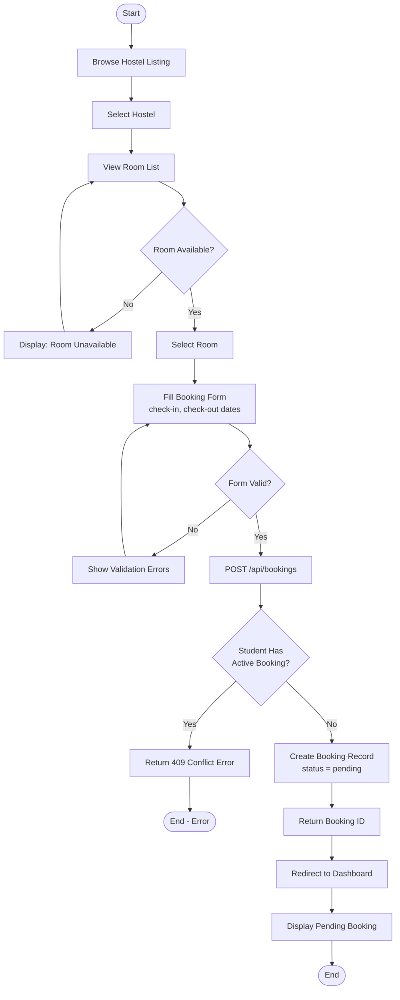
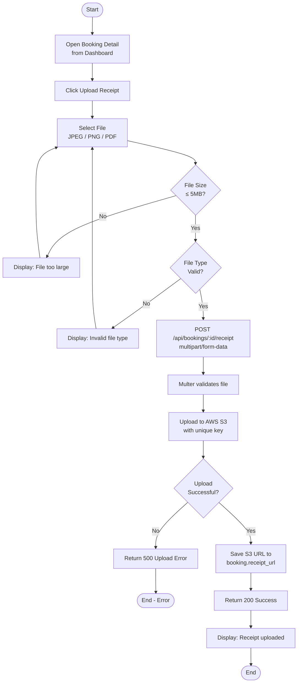
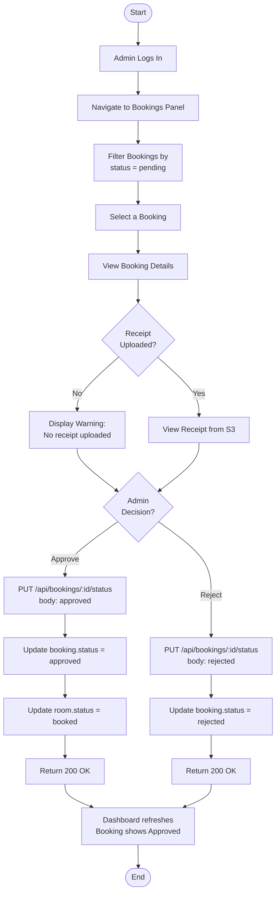
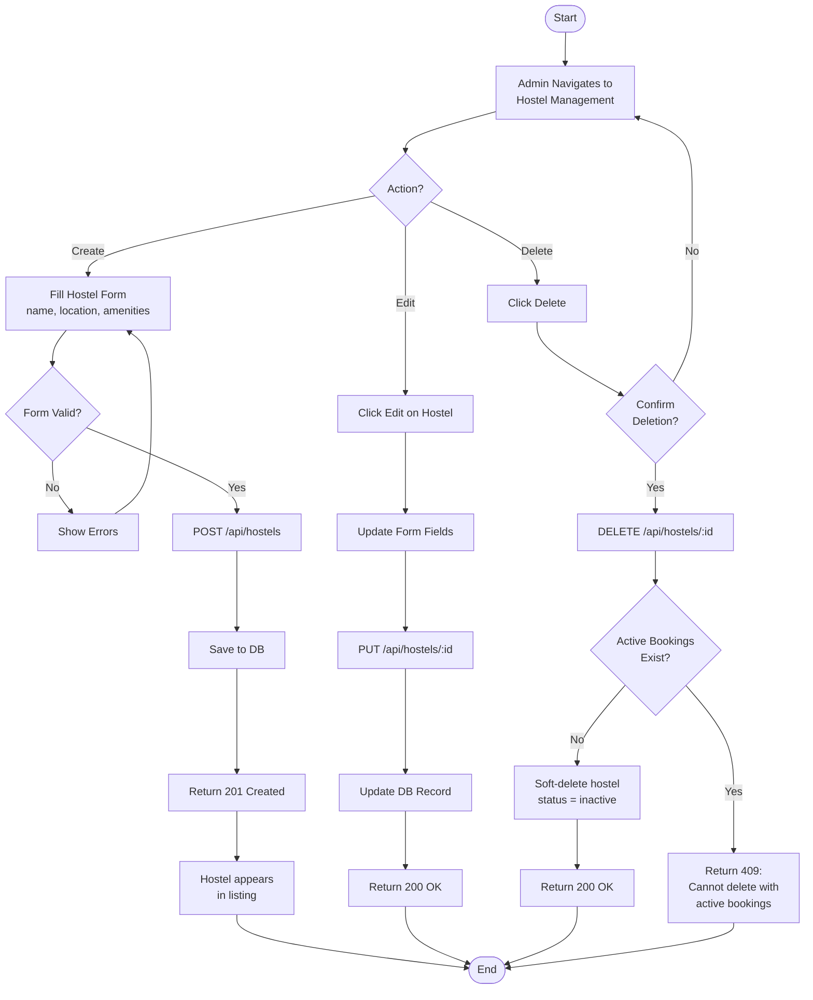

# CloudStay — Activity Diagrams

## AD-01: Student Registration & Login Flow

---

## AD-02: Room Booking Flow

---

## AD-03: Payment Receipt Upload Flow

---

## AD-04: Admin Booking Approval Flow

---

## AD-05: Admin Hostel Management Flow

