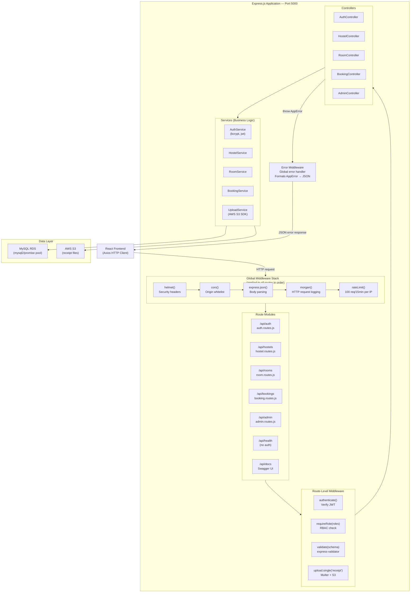

# CloudStay — API Architecture

## REST API Design

**Base URL**: `https://<host>/api`  
**Authentication**: Bearer JWT in `Authorization` header  
**Content-Type**: `application/json` (except file upload: `multipart/form-data`)  
**API Version**: v1 (embedded in path)

---

## API Architecture Diagram



---

## Endpoint Reference

### Authentication — `/api/auth`

| Method | Path | Auth | Body | Response | Description |
|---|---|---|---|---|---|
| POST | `/api/auth/register` | None | `{name, email, studentId, password}` | 201 `{message}` | Register new student |
| POST | `/api/auth/login` | None | `{email, password}` | 200 `{accessToken, refreshToken, user}` | Authenticate user |
| POST | `/api/auth/refresh` | Refresh token | `{refreshToken}` | 200 `{accessToken}` | Renew access token |
| POST | `/api/auth/logout` | Bearer | — | 200 `{message}` | Invalidate client tokens |

---

### Hostels — `/api/hostels`

| Method | Path | Auth | Query Params | Body | Response | Roles |
|---|---|---|---|---|---|---|
| GET | `/api/hostels` | None | `location`, `minPrice`, `maxPrice` | — | 200 `{hostels[]}` | Public |
| GET | `/api/hostels/:id` | None | — | — | 200 `{hostel}` | Public |
| POST | `/api/hostels` | Bearer | — | `{name, location, description, amenities, ...}` | 201 `{hostel}` | Admin |
| PUT | `/api/hostels/:id` | Bearer | — | Partial hostel fields | 200 `{hostel}` | Admin |
| DELETE | `/api/hostels/:id` | Bearer | — | — | 200 `{message}` | Admin |

---

### Rooms — `/api/rooms`

| Method | Path | Auth | Query Params | Body | Response | Roles |
|---|---|---|---|---|---|---|
| GET | `/api/rooms` | None | `hostelId`, `type`, `status` | — | 200 `{rooms[]}` | Public |
| GET | `/api/rooms/:id` | None | — | — | 200 `{room}` | Public |
| POST | `/api/rooms` | Bearer | — | `{hostelId, roomNumber, roomType, capacity, price}` | 201 `{room}` | Admin |
| PUT | `/api/rooms/:id` | Bearer | — | Partial room fields | 200 `{room}` | Admin |
| DELETE | `/api/rooms/:id` | Bearer | — | — | 200 `{message}` | Admin |

---

### Bookings — `/api/bookings`

| Method | Path | Auth | Body | Response | Roles |
|---|---|---|---|---|---|
| POST | `/api/bookings` | Bearer | `{roomId, checkInDate, checkOutDate}` | 201 `{booking}` | Student |
| GET | `/api/bookings/my` | Bearer | — | 200 `{bookings[]}` | Student |
| GET | `/api/bookings` | Bearer | — | 200 `{bookings[]}` | Admin/Manager |
| GET | `/api/bookings/:id` | Bearer | — | 200 `{booking}` | Owner/Admin |
| PUT | `/api/bookings/:id/status` | Bearer | `{status, reviewNote}` | 200 `{booking}` | Admin/Manager |
| PUT | `/api/bookings/:id/cancel` | Bearer | — | 200 `{booking}` | Student (owner) |
| POST | `/api/bookings/:id/receipt` | Bearer | `multipart: receipt file` | 200 `{receiptUrl}` | Student (owner) |

---

### Admin — `/api/admin`

| Method | Path | Auth | Query Params | Body | Response |
|---|---|---|---|---|---|
| GET | `/api/admin/users` | Bearer (Admin) | `role`, `isActive` | — | 200 `{users[]}` |
| PUT | `/api/admin/users/:id/status` | Bearer (Admin) | — | `{isActive}` | 200 `{user}` |
| GET | `/api/admin/stats` | Bearer (Admin) | — | — | 200 `{stats}` |

---

### Health — `/api/health`

| Method | Path | Auth | Response |
|---|---|---|---|
| GET | `/api/health` | None | 200 `{status: "ok", timestamp, uptime}` |

---

## Standard Response Envelope

### Success
```json
{
  "success": true,
  "data": { },
  "message": "Optional message"
}
```

### Error
```json
{
  "success": false,
  "message": "Human-readable error message",
  "errors": [ ]
}
```

### Paginated List
```json
{
  "success": true,
  "data": [ ],
  "pagination": {
    "page": 1,
    "limit": 20,
    "total": 150,
    "pages": 8
  }
}
```

---

## HTTP Status Code Usage

| Code | Meaning | When Used |
|---|---|---|
| 200 | OK | Successful GET, PUT, DELETE |
| 201 | Created | Successful POST (new resource) |
| 400 | Bad Request | Missing/malformed body |
| 401 | Unauthorized | No token or invalid token |
| 403 | Forbidden | Token valid but role insufficient |
| 404 | Not Found | Resource does not exist |
| 409 | Conflict | Duplicate resource or business rule violation |
| 422 | Unprocessable Entity | Validation errors |
| 429 | Too Many Requests | Rate limit exceeded |
| 500 | Internal Server Error | Unexpected server error |
