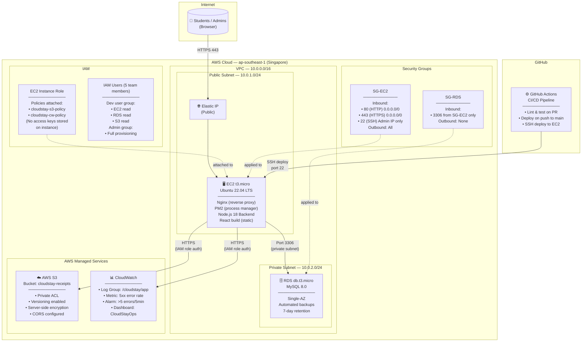

# CloudStay — AWS Architecture Diagram

## High-Level AWS Architecture



---

## AWS Services Summary

| Service | Tier / Size | Purpose | Cost Estimate |
|---|---|---|---|
| **EC2** | t3.micro | Application server (backend + frontend static) | Free Tier / ~$8.50/mo |
| **RDS MySQL** | db.t3.micro, Single-AZ | Managed relational database | Free Tier / ~$15/mo |
| **S3** | Standard storage | Payment receipt file storage | < $0.12/mo |
| **CloudWatch** | Basic metrics + logs | Log aggregation, alarms | Free Tier |
| **IAM** | Roles + Users | Access management | Free |
| **VPC** | Default VPC | Network isolation | Free |
| **Elastic IP** | 1 address | Static public IP for EC2 | Free while attached |

---

## Network Flow

```
Browser → DNS → Elastic IP → EC2 Security Group (port 443)
                                    │
                              Nginx (SSL termination)
                              ├── /api/* → Node.js :5000
                              └── /*     → React static build
                                    │
                             Node.js backend
                             ├── MySQL queries → RDS (port 3306, private subnet)
                             ├── File uploads  → S3 (HTTPS, IAM role)
                             └── App logs      → CloudWatch (HTTPS, IAM role)
```

---

## IAM Least-Privilege Policy Summary

### EC2 Instance Role Policies

**cloudstay-s3-policy** — S3 access for receipt uploads:
```json
{
  "Effect": "Allow",
  "Action": ["s3:PutObject", "s3:GetObject", "s3:DeleteObject"],
  "Resource": "arn:aws:s3:::cloudstay-receipts/*"
}
```

**cloudstay-cw-policy** — CloudWatch Logs agent:
```json
{
  "Effect": "Allow",
  "Action": [
    "logs:CreateLogGroup",
    "logs:CreateLogStream",
    "logs:PutLogEvents",
    "logs:DescribeLogStreams"
  ],
  "Resource": "arn:aws:logs:*:*:log-group:/cloudstay/*"
}
```
