# CloudStay — Class Diagram

## Backend Class Diagram

```mermaid
classDiagram
    direction TB

    %% ─── Controllers ───────────────────────────────────────
    class AuthController {
        +register(req, res, next) void
        +login(req, res, next) void
        +refreshToken(req, res, next) void
        +logout(req, res, next) void
    }

    class HostelController {
        +getAll(req, res, next) void
        +getById(req, res, next) void
        +create(req, res, next) void
        +update(req, res, next) void
        +delete(req, res, next) void
    }

    class RoomController {
        +getByHostel(req, res, next) void
        +getById(req, res, next) void
        +create(req, res, next) void
        +update(req, res, next) void
        +delete(req, res, next) void
    }

    class BookingController {
        +create(req, res, next) void
        +getMyBookings(req, res, next) void
        +getAll(req, res, next) void
        +updateStatus(req, res, next) void
        +cancel(req, res, next) void
        +uploadReceipt(req, res, next) void
    }

    class AdminController {
        +getUsers(req, res, next) void
        +toggleUserStatus(req, res, next) void
        +getStats(req, res, next) void
    }

    %% ─── Services ───────────────────────────────────────────
    class AuthService {
        -db Database
        +register(name, email, studentId, password) Promise~User~
        +login(email, password) Promise~Tokens~
        +hashPassword(password) Promise~string~
        +comparePassword(plain, hash) Promise~boolean~
        +generateAccessToken(payload) string
        +generateRefreshToken(payload) string
        +verifyAccessToken(token) object
    }

    class HostelService {
        -db Database
        +findAll(filters) Promise~Hostel[]~
        +findById(id) Promise~Hostel~
        +create(data) Promise~Hostel~
        +update(id, data) Promise~Hostel~
        +softDelete(id) Promise~void~
    }

    class RoomService {
        -db Database
        +findByHostel(hostelId, filters) Promise~Room[]~
        +findById(id) Promise~Room~
        +create(data) Promise~Room~
        +update(id, data) Promise~Room~
        +delete(id) Promise~void~
        +checkAvailability(roomId) Promise~boolean~
    }

    class BookingService {
        -db Database
        -uploadService UploadService
        +create(studentId, roomId, checkIn, checkOut) Promise~Booking~
        +findByStudent(studentId) Promise~Booking[]~
        +findAll(filters) Promise~Booking[]~
        +updateStatus(id, status, reviewedBy, note) Promise~Booking~
        +cancel(id, studentId) Promise~Booking~
    }

    class UploadService {
        -s3Client S3Client
        -bucket string
        +upload(bookingId, buffer, mimetype) Promise~string~
        +generateKey(bookingId, ext) string
        +delete(key) Promise~void~
    }

    %% ─── Middleware ─────────────────────────────────────────
    class AuthMiddleware {
        +authenticate(req, res, next) void
        -extractToken(header) string
    }

    class RoleMiddleware {
        +requireRole(roles) Function
    }

    class ValidateMiddleware {
        +validate(schema) Function
    }

    class ErrorMiddleware {
        +handle(err, req, res, next) void
    }

    class UploadMiddleware {
        +single(fieldName) Function
        -fileFilter(req, file, cb) void
        -limits object
    }

    %% ─── Models / DTOs ──────────────────────────────────────
    class User {
        +int id
        +string name
        +string email
        +string studentId
        +string passwordHash
        +string role
        +boolean isActive
        +Date createdAt
    }

    class Hostel {
        +int id
        +string name
        +string location
        +string description
        +string amenities
        +boolean isActive
    }

    class Room {
        +int id
        +int hostelId
        +string roomNumber
        +string roomType
        +int capacity
        +number pricePerSemester
        +string status
    }

    class Booking {
        +int id
        +int studentId
        +int roomId
        +int hostelId
        +Date checkIn
        +Date checkOut
        +string status
        +string receiptUrl
        +int reviewedBy
        +string reviewNote
    }

    class AppError {
        +int statusCode
        +string message
        +boolean isOperational
        +constructor(message, statusCode)
    }

    %% ─── Relationships ──────────────────────────────────────
    AuthController ..> AuthService : uses
    HostelController ..> HostelService : uses
    RoomController ..> RoomService : uses
    BookingController ..> BookingService : uses
    BookingController ..> UploadService : uses
    AdminController ..> AuthService : uses
    AdminController ..> BookingService : uses

    AuthService ..> User : creates / returns
    HostelService ..> Hostel : creates / returns
    RoomService ..> Room : creates / returns
    BookingService ..> Booking : creates / returns
    BookingService ..> UploadService : delegates upload

    AuthMiddleware ..> AppError : throws
    RoleMiddleware ..> AppError : throws
    ValidateMiddleware ..> AppError : throws
    ErrorMiddleware ..> AppError : handles
```

---

## Layer Responsibilities

| Layer | Purpose | Files |
|---|---|---|
| **Controllers** | Parse HTTP request, delegate to service, format response | `*.controller.js` |
| **Services** | Business logic, DB interaction, error throwing | `*.service.js` |
| **Middleware** | Cross-cutting: auth, validation, upload, error | `*.middleware.js` |
| **Models/DTOs** | Shape of data flowing through system | Implicit in DB schema |
| **AppError** | Structured operational error with HTTP code | `utils/AppError.js` |
