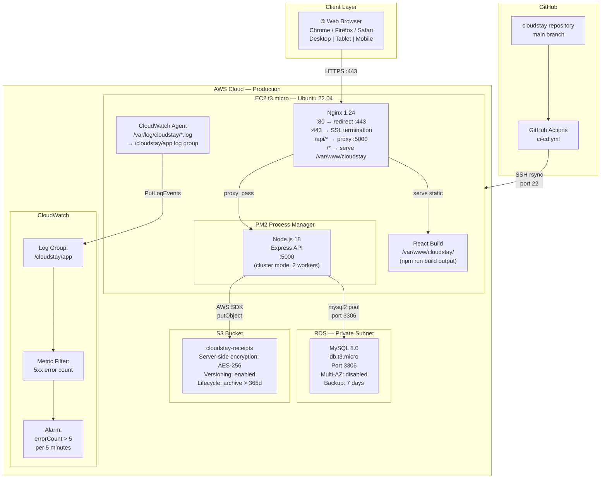
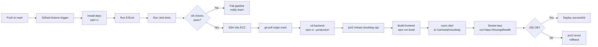

# CloudStay — Deployment Diagram

## Production Deployment Architecture



---

## Deployment Stack Per Layer

### EC2 Software Stack

```
Ubuntu 22.04 LTS
│
├── System
│   ├── OpenSSL 3.x        (SSL/TLS)
│   ├── Nginx 1.24         (Reverse proxy)
│   └── CloudWatch Agent   (Log shipping)
│
├── Runtime
│   ├── Node.js 18.x       (LTS)
│   ├── npm 9.x
│   └── PM2 5.x            (Process manager)
│
├── Application
│   ├── backend/           (Express API — port 5000)
│   └── /var/www/cloudstay (React static build)
│
└── Configuration
    ├── /etc/nginx/sites-enabled/cloudstay.conf
    ├── /home/ubuntu/cloudstay/backend/.env
    ├── /opt/aws/amazon-cloudwatch-agent/etc/config.json
    └── pm2 ecosystem.config.js
```

### Environment Variables (Production)

```bash
# backend/.env (on EC2 — never in repo)
NODE_ENV=production
PORT=5000
DB_HOST=<rds-endpoint>.rds.amazonaws.com
DB_PORT=3306
DB_NAME=cloudstay
DB_USER=cloudstay_app
DB_PASSWORD=<secure-password>
JWT_SECRET=<256-bit-random>
JWT_REFRESH_SECRET=<256-bit-random>
JWT_EXPIRES_IN=1h
JWT_REFRESH_EXPIRES_IN=7d
AWS_REGION=ap-southeast-1
AWS_S3_BUCKET=cloudstay-receipts
CORS_ORIGIN=https://<your-domain-or-ec2-ip>
LOG_LEVEL=info
```

---

## CI/CD Pipeline Flow


