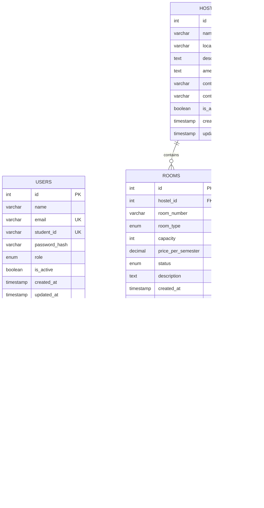

# CloudStay — Entity Relationship Diagram

## ER Diagram (Crow's Foot Notation)

---

## Relationship Descriptions

| Relationship | Cardinality | Description |
|---|---|---|
| USERS → BOOKINGS (places) | One-to-Many | One student can have many bookings (one active at a time) |
| USERS → BOOKINGS (reviews) | One-to-Many | One admin/manager can review many bookings |
| HOSTELS → ROOMS | One-to-Many | One hostel contains many rooms |
| HOSTELS → BOOKINGS | One-to-Many | One hostel has many bookings (denormalised FK for query performance) |
| ROOMS → BOOKINGS | One-to-Many | One room can have many booking records over time |

---

## Enum Value Definitions

### USERS.role
| Value | Description |
|---|---|
| `student` | Regular student — can browse and book |
| `manager` | Hostel manager — can approve/reject |
| `admin` | Full system access |

### ROOMS.room_type
| Value | Description |
|---|---|
| `single` | Single occupancy room |
| `double` | Double occupancy room |
| `triple` | Triple occupancy room |
| `suite` | Premium suite |

### ROOMS.status
| Value | Description |
|---|---|
| `available` | Room is open for booking |
| `booked` | Room has an approved booking |
| `maintenance` | Room temporarily unavailable |

### BOOKINGS.status
| Value | Description |
|---|---|
| `pending` | Awaiting admin review |
| `approved` | Booking confirmed |
| `rejected` | Booking denied by admin |
| `cancelled` | Cancelled by student |
