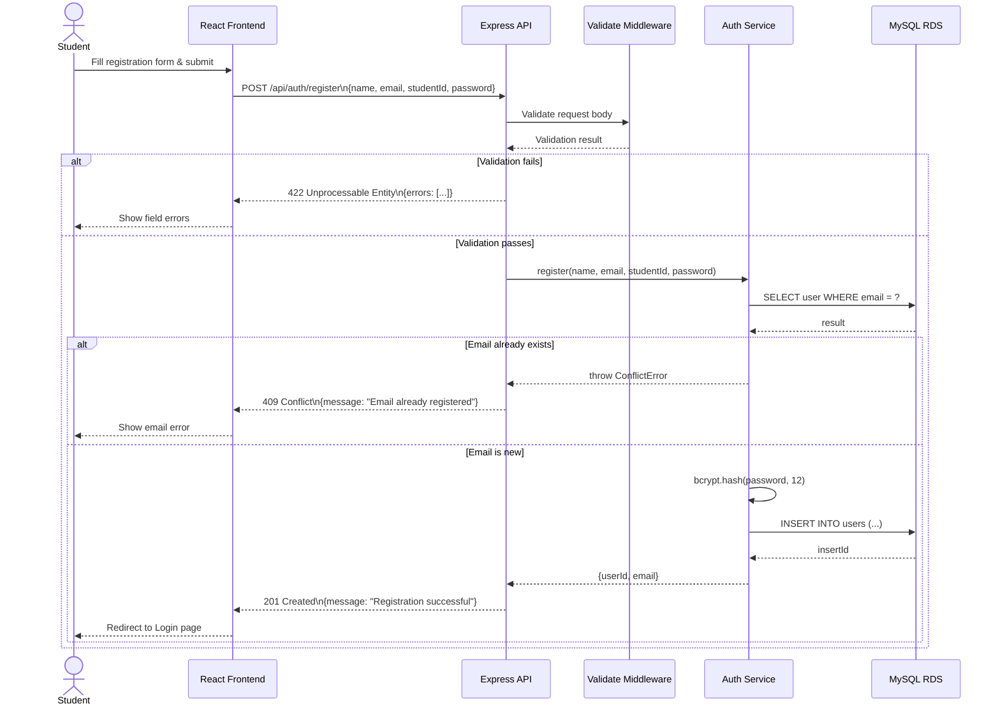
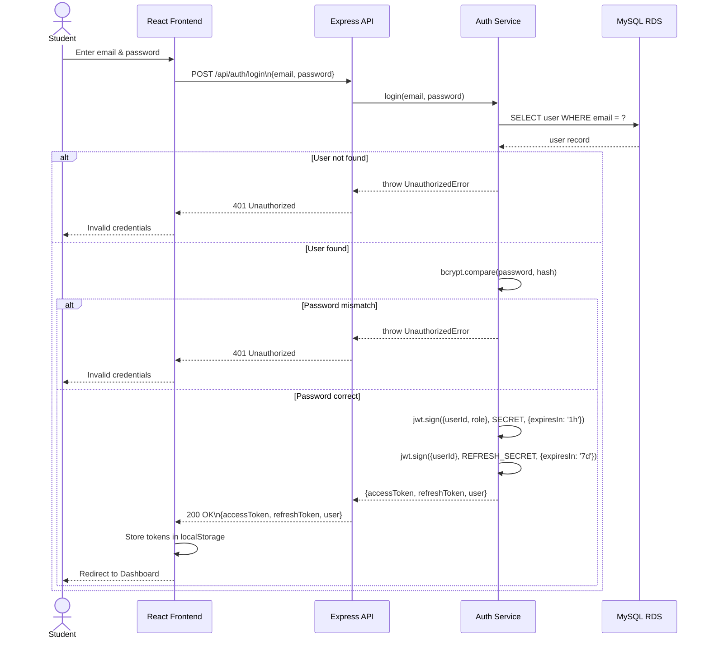
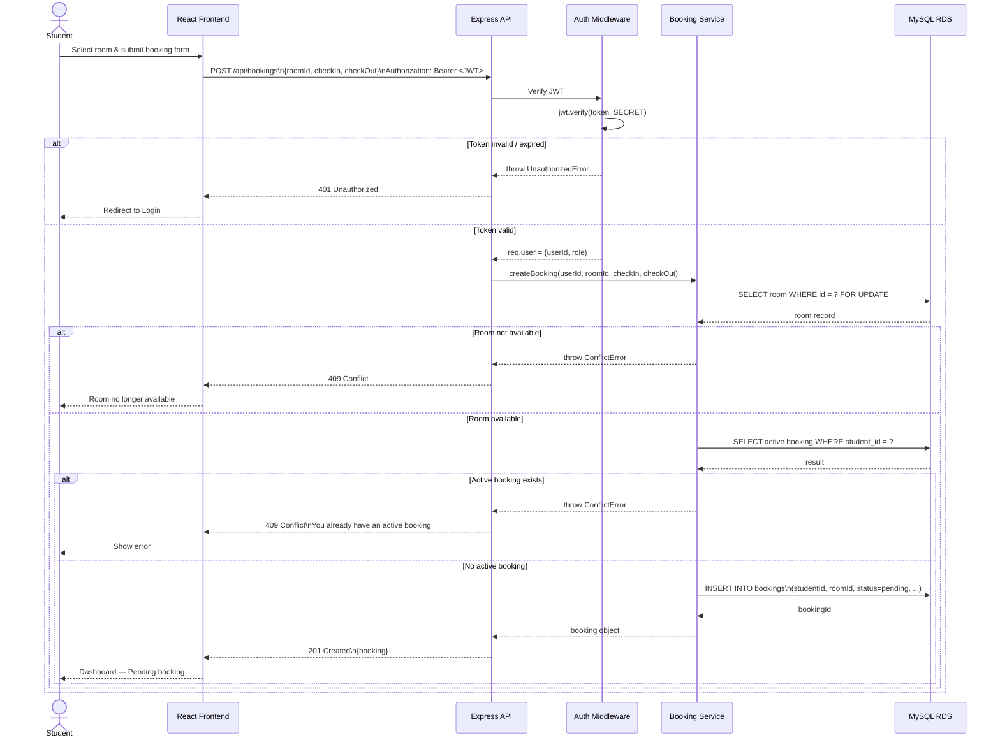
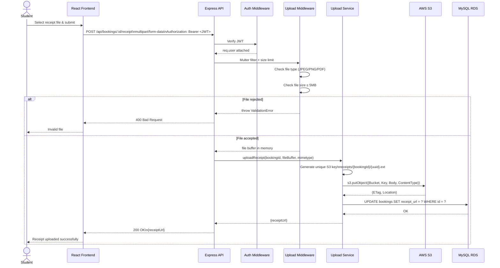
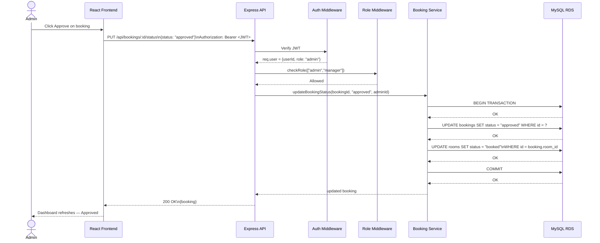

# CloudStay — Sequence Diagrams

## SD-01: User Registration

---

## SD-02: User Login & JWT Issuance

---

## SD-03: Create Booking

---

## SD-04: Upload Payment Receipt to S3

---

## SD-05: Admin Approves Booking

