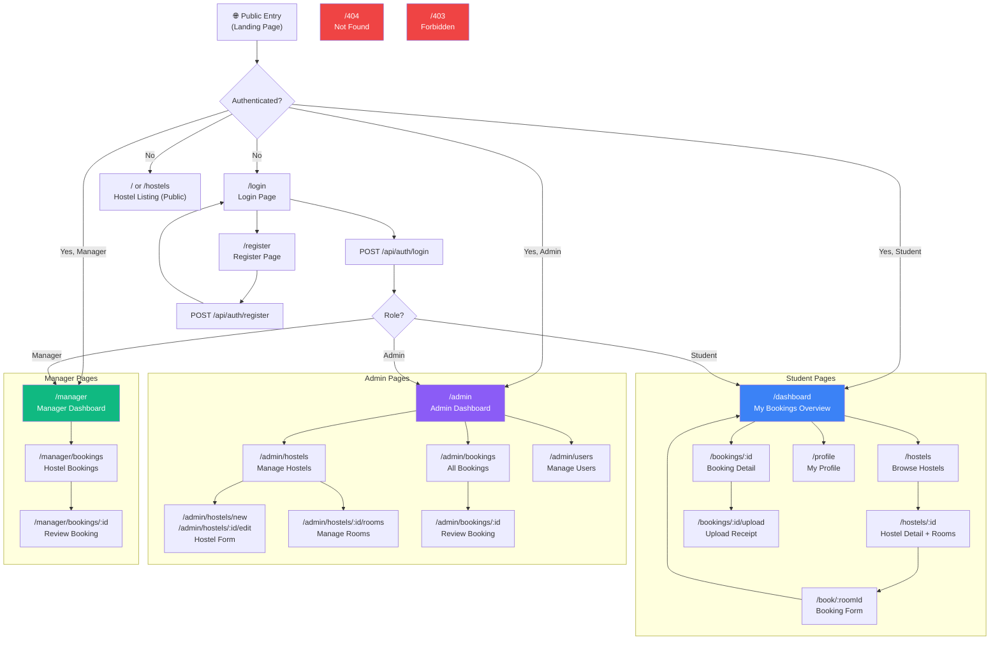
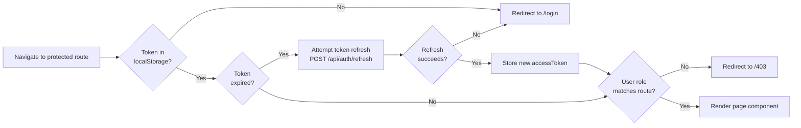

# CloudStay — UI Navigation Flow

## Application Navigation Map

---

## Page Inventory

### Public Pages (No Auth Required)

| Route | Component | Description |
|---|---|---|
| `/` | `LandingPage` | Hero banner, CTA to browse hostels |
| `/login` | `LoginPage` | Email/password login form |
| `/register` | `RegisterPage` | Student registration form |
| `/hostels` | `HostelListingPage` | Browse all hostels with search/filter |
| `/hostels/:id` | `HostelDetailPage` | Hostel info + room list |
| `/404` | `NotFoundPage` | 404 error page |
| `/403` | `ForbiddenPage` | Access denied page |

---

### Student Pages (Auth: `student` role)

| Route | Component | Description |
|---|---|---|
| `/dashboard` | `StudentDashboard` | Active booking, quick stats |
| `/book/:roomId` | `BookingForm` | Book a specific room |
| `/bookings/:id` | `BookingDetail` | View booking details + status |
| `/bookings/:id/upload` | `UploadReceiptPage` | Upload payment receipt |
| `/profile` | `ProfilePage` | View/edit student profile |

---

### Admin Pages (Auth: `admin` role)

| Route | Component | Description |
|---|---|---|
| `/admin` | `AdminDashboard` | Summary stats: users, bookings, occupancy |
| `/admin/hostels` | `HostelManagement` | CRUD hostel list |
| `/admin/hostels/new` | `HostelForm` | Create new hostel |
| `/admin/hostels/:id/edit` | `HostelForm` | Edit hostel |
| `/admin/hostels/:id/rooms` | `RoomManagement` | CRUD rooms for hostel |
| `/admin/bookings` | `BookingManagement` | Filter/view all bookings |
| `/admin/bookings/:id` | `BookingReview` | Approve/reject with receipt view |
| `/admin/users` | `UserManagement` | List and toggle user status |

---

### Manager Pages (Auth: `manager` role)

| Route | Component | Description |
|---|---|---|
| `/manager` | `ManagerDashboard` | Pending booking count |
| `/manager/bookings` | `ManagerBookingList` | Bookings for this manager's hostel |
| `/manager/bookings/:id` | `ManagerBookingReview` | Approve/reject with receipt view |

---

## Protected Route Logic

---

## Component Reuse Map

| Component | Used In |
|---|---|
| `BookingStatusBadge` | StudentDashboard, BookingDetail, AdminBookingList, ManagerBookingList |
| `HostelCard` | HostelListingPage, AdminDashboard |
| `RoomCard` | HostelDetailPage, RoomManagement |
| `BookingCard` | StudentDashboard, BookingManagement |
| `FileUploadDropzone` | UploadReceiptPage |
| `ConfirmModal` | Delete hostel, cancel booking, deactivate user |
| `LoadingSpinner` | All pages during API fetch |
| `ErrorAlert` | All forms, data fetch failures |
| `Pagination` | BookingManagement, UserManagement, HostelListing |
| `Navbar` | All pages (role-aware links) |
| `ProtectedRoute` | All authenticated routes |
