# CloudStay — Use Case Diagram

## System Actors

| Actor | Description |
|---|---|
| **Student** | Registered user who browses and books hostel rooms |
| **Hostel Manager** | Staff who approves/rejects bookings for their hostel |
| **Admin** | Full system access — manages users, hostels, rooms |
| **AWS S3** | External system — receives uploaded payment receipts |

---

## Use Case Diagram

```mermaid
graph TB
    subgraph CloudStay System
        direction TB

        subgraph Authentication
            UC1[Register Account]
            UC2[Login]
            UC3[Logout]
            UC4[Refresh Token]
        end

        subgraph Hostel Management
            UC5[Browse Hostels]
            UC6[View Hostel Detail]
            UC7[Create Hostel]
            UC8[Update Hostel]
            UC9[Delete Hostel]
        end

        subgraph Room Management
            UC10[View Room Availability]
            UC11[Create Room]
            UC12[Update Room]
            UC13[Delete Room]
        end

        subgraph Booking Management
            UC14[Create Booking]
            UC15[View My Bookings]
            UC16[Cancel Booking]
            UC17[View All Bookings]
            UC18[Approve Booking]
            UC19[Reject Booking]
        end

        subgraph Payment
            UC20[Upload Payment Receipt]
            UC21[View Receipt]
        end

        subgraph User Management
            UC22[View All Users]
            UC23[Activate / Deactivate User]
        end
    end

    Student((Student))
    Manager((Hostel Manager))
    Admin((Admin))
    S3((AWS S3))

    %% Student use cases
    Student --> UC1
    Student --> UC2
    Student --> UC3
    Student --> UC5
    Student --> UC6
    Student --> UC10
    Student --> UC14
    Student --> UC15
    Student --> UC16
    Student --> UC20

    %% Manager use cases
    Manager --> UC2
    Manager --> UC3
    Manager --> UC17
    Manager --> UC18
    Manager --> UC19
    Manager --> UC21

    %% Admin use cases
    Admin --> UC2
    Admin --> UC3
    Admin --> UC7
    Admin --> UC8
    Admin --> UC9
    Admin --> UC11
    Admin --> UC12
    Admin --> UC13
    Admin --> UC17
    Admin --> UC18
    Admin --> UC19
    Admin --> UC21
    Admin --> UC22
    Admin --> UC23

    %% External system
    UC20 -.->|store file| S3
    UC21 -.->|fetch URL| S3
```

---

## Use Case Descriptions Summary

| Use Case | Actor(s) | Brief Description |
|---|---|---|
| UC1 Register | Student | Create account with name, email, student ID, password |
| UC2 Login | All | Authenticate and receive JWT |
| UC3 Logout | All | Invalidate client-side token |
| UC5 Browse Hostels | Student | View list of all active hostels with filters |
| UC6 View Hostel Detail | Student | See rooms, pricing, amenities |
| UC7 Create Hostel | Admin | Add new hostel to system |
| UC10 View Room Availability | Student | See available rooms in a hostel |
| UC14 Create Booking | Student | Book an available room |
| UC15 View My Bookings | Student | Track all bookings and their status |
| UC16 Cancel Booking | Student | Cancel a pending booking |
| UC18 Approve Booking | Admin/Manager | Approve pending booking → room becomes booked |
| UC19 Reject Booking | Admin/Manager | Reject booking with reason |
| UC20 Upload Receipt | Student | Upload payment proof to S3 |
| UC21 View Receipt | Admin/Manager | Review payment receipt from S3 |
| UC22 View All Users | Admin | See full user list with roles |
| UC23 Activate/Deactivate | Admin | Toggle user account access |
