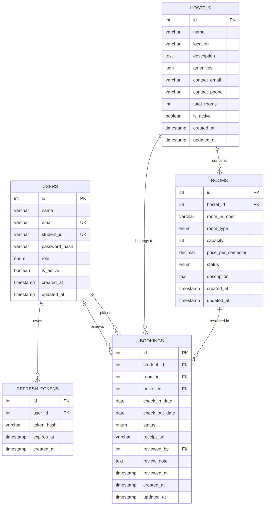

# CloudStay Student Hostel Booking System
## Final Technical Report

**Document Version:** 1.0  
**System Version:** 1.0.0  
**Prepared by:** CloudStay Development Team  
**Date:** August 2026  
**Course:** Software Engineering Capstone Project

---

## Table of Contents

1. [Executive Summary](#1-executive-summary)
2. [Problem Statement and Objectives](#2-problem-statement-and-objectives)
3. [System Overview](#3-system-overview)
4. [Technology Stack](#4-technology-stack)
5. [System Architecture](#5-system-architecture)
   - 5.1 [Architectural Pattern](#51-architectural-pattern)
   - 5.2 [Component Architecture](#52-component-architecture)
   - 5.3 [Cloud Infrastructure (AWS)](#53-cloud-infrastructure-aws)
   - 5.4 [Network and Security Architecture](#54-network-and-security-architecture)
6. [Database Design](#6-database-design)
   - 6.1 [Schema Overview](#61-schema-overview)
   - 6.2 [Table Descriptions](#62-table-descriptions)
   - 6.3 [Database Optimisations](#63-database-optimisations)
7. [Backend API Design](#7-backend-api-design)
   - 7.1 [API Design Principles](#71-api-design-principles)
   - 7.2 [Middleware Pipeline](#72-middleware-pipeline)
   - 7.3 [Endpoint Reference Summary](#73-endpoint-reference-summary)
   - 7.4 [Standard Response Envelope](#74-standard-response-envelope)
8. [Authentication and Security](#8-authentication-and-security)
   - 8.1 [JWT Token Strategy](#81-jwt-token-strategy)
   - 8.2 [Password Security](#82-password-security)
   - 8.3 [Role-Based Access Control](#83-role-based-access-control)
   - 8.4 [Additional Security Measures](#84-additional-security-measures)
9. [Core Feature Implementation](#9-core-feature-implementation)
   - 9.1 [Booking Workflow](#91-booking-workflow)
   - 9.2 [Payment Receipt Upload (AWS S3)](#92-payment-receipt-upload-aws-s3)
   - 9.3 [Hostel and Room Management](#93-hostel-and-room-management)
10. [Frontend Architecture](#10-frontend-architecture)
    - 10.1 [Technology and Build](#101-technology-and-build)
    - 10.2 [Application Routing and Role Guards](#102-application-routing-and-role-guards)
    - 10.3 [State Management](#103-state-management)
11. [Testing Strategy](#11-testing-strategy)
    - 11.1 [Testing Approach](#111-testing-approach)
    - 11.2 [Test Suites](#112-test-suites)
    - 11.3 [Continuous Integration](#113-continuous-integration)
12. [AWS Cloud Integration](#12-aws-cloud-integration)
    - 12.1 [S3 File Storage](#121-s3-file-storage)
    - 12.2 [IAM Least-Privilege Policy](#122-iam-least-privilege-policy)
    - 12.3 [CloudWatch Monitoring](#123-cloudwatch-monitoring)
13. [Deployment Architecture](#13-deployment-architecture)
14. [Challenges and Solutions](#14-challenges-and-solutions)
15. [Future Work and Recommendations](#15-future-work-and-recommendations)
16. [Conclusion](#16-conclusion)
17. [Appendix A — Full API Route Reference](#appendix-a--full-api-route-reference)
18. [Appendix B — Database Schema Summary](#appendix-b--database-schema-summary)

---

## 1. Executive Summary

CloudStay is a full-stack web application developed by the project team to modernise student hostel accommodation booking at university level. The system replaces a manual, paper-based application process with an end-to-end digital workflow: students browse and book rooms online, upload payment receipts, and track booking status in real time; administrators and managers review applications and manage hostel inventory through a dedicated dashboard.

The system was built using a **React + Vite** frontend, a **Node.js / Express** REST API backend, a **MySQL** relational database hosted on **Amazon RDS**, and **AWS S3** for secure file storage. The team deployed the application to an **AWS EC2** instance with **Nginx** as a reverse proxy. A **GitHub Actions** CI/CD pipeline automates testing and build validation on every push and pull request.

---

## 2. Problem Statement and Objectives

### 2.1 Problem Statement

Many university hostel booking processes remain entirely manual — students queue in person, fill in paper forms, and wait days or weeks for approval. This creates inefficiencies for both students seeking accommodation and administrators managing high volumes of applications. Records are difficult to search, receipts are lost, and real-time status visibility is non-existent.

### 2.2 Project Objectives

The development team set out to achieve the following objectives:

| # | Objective |
|---|---|
| O1 | Provide a web-accessible hostel browsing experience that requires no login |
| O2 | Enable students to register, log in, and submit booking applications online |
| O3 | Allow students to upload digital payment receipts for their bookings |
| O4 | Provide administrators and managers with a dashboard to review, approve, or reject bookings |
| O5 | Enforce business rules to prevent double-booking and invalid state transitions |
| O6 | Secure the application with JWT authentication, RBAC, and transport encryption |
| O7 | Deploy the system to a cloud environment with automated CI/CD |

---

## 3. System Overview

CloudStay consists of two principal subsystems:

**Backend REST API** — an Express.js application exposing JSON endpoints under `/api/`. It implements all business logic through a layered architecture (routes → middleware → controllers → services → database).

**Frontend SPA** — a React single-page application that communicates with the backend via Axios HTTP calls. It provides role-specific views for students, administrators, and managers.

### User Roles

| Role | Permissions |
|---|---|
| **Guest** | Browse hostels and rooms (read-only, no authentication required) |
| **Student** | Register, log in, create bookings, upload receipts, cancel bookings |
| **Manager** | All student permissions + view all bookings, approve/reject bookings |
| **Admin** | All manager permissions + manage hostels, rooms, and user accounts |

---

## 4. Technology Stack

### Backend

| Component | Technology | Version |
|---|---|---|
| Runtime | Node.js | ≥ 18.0.0 |
| Framework | Express.js | ^4.19.2 |
| Database driver | mysql2 (promise pool) | ^3.10.1 |
| Authentication | jsonwebtoken | ^9.0.2 |
| Password hashing | bcryptjs | ^2.4.3 |
| Input validation | express-validator | ^7.1.0 |
| File upload | multer (memory storage) | ^1.4.5 |
| AWS SDK | @aws-sdk/client-s3 | ^3.600.0 |
| HTTP security headers | helmet | ^7.1.0 |
| CORS | cors | ^2.8.5 |
| Rate limiting | express-rate-limit | ^7.3.1 |
| Logging | winston + morgan | ^3.13.0 / ^1.10.0 |
| API documentation | swagger-jsdoc + swagger-ui-express | ^6.2.8 / ^5.0.1 |
| Testing | Jest + Supertest | ^29.7.0 / ^7.0.0 |

### Frontend

| Component | Technology | Version |
|---|---|---|
| UI framework | React | ^18.3.1 |
| Build tool | Vite | ^5.3.3 |
| Routing | React Router DOM | ^6.24.1 |
| HTTP client | Axios | ^1.7.2 |
| Icons | lucide-react | ^0.400.0 |
| Toast notifications | react-hot-toast | ^2.4.1 |

### Infrastructure

| Component | Service |
|---|---|
| Application server | AWS EC2 t3.micro (Ubuntu 22.04 LTS) |
| Database | AWS RDS db.t3.micro — MySQL 8.0, Single-AZ |
| File storage | AWS S3 (bucket: `cloudstay-receipts`) |
| Monitoring | AWS CloudWatch |
| Reverse proxy | Nginx |
| Process manager | PM2 |
| CI/CD | GitHub Actions |

---

## 5. System Architecture

### 5.1 Architectural Pattern

The team adopted a **three-tier architecture**:

1. **Presentation tier** — React SPA served as static files by Nginx
2. **Application tier** — Express.js REST API, hosted on the same EC2 instance, served at port 5000 behind Nginx reverse proxy
3. **Data tier** — MySQL RDS in a private subnet; AWS S3 for binary receipt files

The backend itself follows a **layered internal pattern**:

```
HTTP Request
    ↓
Global Middleware (helmet, cors, body-parser, morgan, rate-limiter)
    ↓
Route Module  (/api/auth | /api/hostels | /api/rooms | /api/bookings | /api/admin)
    ↓
Route-Level Middleware  (authenticate, requireRole, validate, uploadSingle)
    ↓
Controller  (parse request, call service, send response)
    ↓
Service  (all business logic, SQL queries, AWS calls)
    ↓
Data Layer  (MySQL pool / S3 client)
```

### 5.2 Component Architecture

```
Backend
├── config/
│   ├── app.js          — Express app setup, middleware registration, route mounting
│   ├── database.js     — mysql2 connection pool
│   └── aws.js          — S3Client and bucket configuration
├── routes/             — HTTP route definitions (auth, hostel, room, booking, admin)
├── controllers/        — Request/response handling
├── services/           — Business logic (auth.service, booking.service, hostel.service, upload.service)
├── middleware/         — authenticate, requireRole, validate, upload, errorHandler
├── validators/         — express-validator rule sets
└── utils/              — AppError class, sendSuccess/sendPaginated helpers, Winston logger

Frontend
├── pages/
│   ├── public/         — HostelListingPage, HostelDetailPage
│   ├── auth/           — LoginPage, RegisterPage
│   ├── student/        — StudentDashboard, BookingForm, BookingDetail, UploadReceiptPage, ProfilePage
│   └── admin/          — AdminDashboard, AdminBookings, AdminBookingReview, AdminHostels, AdminUsers, ManagerDashboard
├── components/         — Layout (Navbar, Footer), common (Spinner)
├── context/            — AuthContext (JWT state, user object)
├── api/                — Axios instance configuration
└── router/             — Route guards (ProtectedRoute, GuestRoute)
```

### 5.3 Cloud Infrastructure (AWS)

The team provisioned all cloud resources within the **ap-southeast-1 (Singapore)** region.

```
VPC — 10.0.0.0/16
├── Public Subnet (10.0.1.0/24)
│   └── EC2 t3.micro
│       ├── Nginx (reverse proxy, SSL termination)
│       ├── PM2 (process manager)
│       ├── Node.js 18 (Express API — port 5000)
│       └── React static build (served at /)
│
└── Private Subnet (10.0.2.0/24)
    └── RDS db.t3.micro — MySQL 8.0
        (accessible only from EC2 security group on port 3306)

AWS Managed Services
├── S3 bucket: cloudstay-receipts (private, server-side encryption AES-256)
├── CloudWatch: log group /cloudstay/app, 5xx alarm
└── IAM: EC2 instance role with least-privilege S3 and CloudWatch policies
```

### 5.4 Network and Security Architecture

- All inbound traffic enters through the **Elastic IP** on the EC2 security group.
- Nginx terminates SSL and acts as reverse proxy: `/api/*` → Node.js port 5000, `/*` → React static build.
- The RDS instance is in a **private subnet** with its security group accepting port 3306 only from the EC2 security group.
- S3 access is granted to the EC2 instance through an **IAM instance role** — no access keys are stored on the server.

---

## 6. Database Design

### 6.1 Schema Overview

The database (`cloudstay`, MySQL 8.0) contains five tables and two administrative views.



### 6.2 Table Descriptions

| Table | Purpose |
|---|---|
| `users` | Stores all platform users. Roles: `student`, `manager`, `admin`. `password_hash` is a bcrypt digest; plaintext passwords are never stored. |
| `hostels` | Hostel buildings. Amenities are stored as a JSON array. `total_rooms` is a denormalised count maintained by database triggers. Soft-delete via `is_active = 0`. |
| `rooms` | Individual rooms within a hostel. Room type enum: `single`, `double`, `triple`, `suite`. Status enum: `available`, `booked`, `maintenance`. |
| `bookings` | Central booking records. `hostel_id` is denormalised for query performance. `receipt_url` stores the S3 object URL after upload. Status enum: `pending`, `approved`, `rejected`, `cancelled`. |
| `refresh_tokens` | Server-side store of hashed refresh tokens, enabling server-side session invalidation on logout. Cascades on user deletion. |

### 6.3 Database Optimisations

The team implemented the following optimisations during schema design:

**Indexes:** Every foreign key column carries an explicit index. Composite index `idx_bookings_hostel_status (hostel_id, status)` accelerates admin dashboard queries that filter by hostel and status simultaneously.

**Full-text search:** A `FULLTEXT INDEX ft_hostels_search (name, location, description)` is defined on the `hostels` table (available for future keyword search features).

**Triggers:** Two `AFTER INSERT` / `AFTER DELETE` triggers on `rooms` maintain the denormalised `hostels.total_rooms` counter automatically, eliminating the need for a subquery in every hostel list request.

**Views:**
- `v_room_availability` — student-facing view of available rooms joined with hostel context
- `v_booking_summary` — admin-facing join of bookings, users, rooms, and hostels

**CHECK constraint:** `chk_booking_dates CHECK (check_out_date > check_in_date)` is enforced at the database layer as a backup to application-level validation.

**Connection pooling:** The backend uses the `mysql2` promise pool, avoiding the overhead of creating a new connection per request.

---

## 7. Backend API Design

### 7.1 API Design Principles

The team designed the REST API adhering to the following principles:

- **Resource-oriented URLs** — paths identify resources (`/api/bookings`, `/api/hostels/:id`)
- **HTTP verb semantics** — GET for reads, POST for creation, PUT/PATCH for updates, DELETE for removal
- **Consistent response envelope** — all responses share the same `{ success, data, message, pagination }` shape
- **Predictable HTTP status codes** — 201 for creation, 409 for business-rule conflicts, 422 for validation failures, 401/403 for auth/authz
- **Swagger documentation** — OpenAPI spec auto-generated via `swagger-jsdoc` and served at `/api/docs` in non-production environments

### 7.2 Middleware Pipeline

Every request to `/api/*` passes through the following global middleware stack in order:

| Order | Middleware | Purpose |
|---|---|---|
| 1 | `helmet()` | Sets security-related HTTP response headers (CSP, HSTS, etc.) |
| 2 | `cors()` | Restricts cross-origin requests to the configured `CORS_ORIGIN` |
| 3 | `express.json()` | Parses JSON request bodies (limit: 10 KB) |
| 4 | `morgan('combined')` | Structured HTTP access logging via Winston |
| 5 | `rateLimit` (global) | 100 requests per IP per 15 minutes |
| 5a | `rateLimit` (auth) | 10 requests per IP per 15 minutes on `/api/auth` |

Route-level middleware (applied per route as needed):

| Middleware | Purpose |
|---|---|
| `authenticate()` | Verifies the `Authorization: Bearer <JWT>` header; attaches `req.user = { userId, role }` |
| `requireRole(roles)` | Checks `req.user.role` is in the permitted set; throws 403 otherwise |
| `validate(schema)` | Runs `express-validator` rule chains and collects errors into a 422 response |
| `uploadSingle('receipt')` | Multer memory-storage; enforces MIME whitelist (JPEG/PNG/PDF) and 5 MB size limit |

### 7.3 Endpoint Reference Summary

| Route Group | Base Path | Public | Student | Admin/Manager |
|---|---|---|---|---|
| Auth | `/api/auth` | register, login, refresh | logout | — |
| Hostels | `/api/hostels` | GET list, GET detail | — | POST create, PUT update, DELETE |
| Rooms | `/api/rooms` | GET by hostel, GET detail | — | POST create, PUT update, DELETE |
| Bookings | `/api/bookings` | — | POST create, GET /my, PUT cancel, POST receipt | GET all, PUT status |
| Admin | `/api/admin` | — | — | GET users, PUT status, GET stats |
| Health | `/api/health` | GET | — | — |

(Full endpoint reference with request/response bodies: see [Appendix A](#appendix-a--full-api-route-reference))

### 7.4 Standard Response Envelope

All API responses share a consistent JSON envelope:

**Success:**
```json
{
  "success": true,
  "message": "Optional descriptive message",
  "data": { }
}
```

**Paginated list:**
```json
{
  "success": true,
  "data": [ ],
  "pagination": {
    "page": 1,
    "limit": 20,
    "total": 150,
    "pages": 8
  }
}
```

**Error:**
```json
{
  "success": false,
  "message": "Human-readable error description",
  "errors": [ ]
}
```

---

## 8. Authentication and Security

### 8.1 JWT Token Strategy

The system implements a **dual-token** authentication strategy:

| Token | Secret | Expiry | Purpose |
|---|---|---|---|
| **Access token** | `JWT_SECRET` | 1 hour | Authorises API requests (sent in `Authorization: Bearer` header) |
| **Refresh token** | `JWT_REFRESH_SECRET` | 7 days | Obtains new access tokens without re-login |

The JWT payload carries `{ userId, role }`. The middleware decodes this and attaches it to `req.user` for downstream use.

**Refresh token security:** Refresh tokens are not trusted purely on cryptographic validity. Upon login, a bcrypt hash of the refresh token is stored in the `refresh_tokens` table with an `expires_at` timestamp. The `/api/auth/refresh` endpoint verifies the token against the database before issuing a new access token. Logout calls `/api/auth/logout`, which deletes all stored refresh tokens for the user, performing server-side session invalidation.

### 8.2 Password Security

Passwords are hashed using **bcryptjs** with a salt cost factor of **12** before storage. No plaintext password is ever written to disk or logged. The `password_hash` column in `users` stores only the computed hash. Login compares the submitted password to the stored hash using `bcrypt.compare()`.

### 8.3 Role-Based Access Control

The `requireRole(roles)` middleware reads `req.user.role` (set by `authenticate()`) and compares it against the permitted role list for each route. Three roles are implemented:

| Role | Value | Description |
|---|---|---|
| Student | `student` | Default role for self-registered users |
| Manager | `manager` | Hostel manager; can review bookings |
| Admin | `admin` | Full system access |

Route-level guards enforce the principle of least privilege. For example, `GET /api/admin/users` is restricted to `['admin']`; `PUT /api/bookings/:id/status` is restricted to `['admin', 'manager']`.

### 8.4 Additional Security Measures

| Measure | Implementation |
|---|---|
| Security headers | `helmet()` middleware sets `Content-Security-Policy`, `X-Content-Type-Options`, `Strict-Transport-Security`, etc. |
| Rate limiting | Global: 100 req/15 min; Auth routes: 10 req/15 min — mitigates brute-force attacks |
| Body size limit | `express.json({ limit: '10kb' })` — prevents large-payload attacks |
| CORS | Origin restricted to `CORS_ORIGIN` environment variable (default: `http://localhost:5173`) |
| S3 file privacy | Uploaded receipts use a private bucket ACL and IAM role access — no public URLs |
| Server-side encryption | S3 uploads specify `ServerSideEncryption: 'AES256'` |
| Input validation | All mutable endpoints validate input through `express-validator` rule chains before processing |
| SQL injection | All database queries use parameterised statements via the `mysql2` prepared statement API |

---

## 9. Core Feature Implementation

### 9.1 Booking Workflow

The booking creation logic in `booking.service.js` is designed to be **race-condition safe** through the use of MySQL transactions and pessimistic row locking:

```
Student submits booking
    → BEGIN TRANSACTION
    → SELECT … FROM rooms WHERE id = ? FOR UPDATE  (acquires row lock)
    → IF room.status ≠ 'available' → ROLLBACK → 409 Conflict
    → SELECT COUNT(*) FROM bookings WHERE student_id = ? AND status IN ('pending','approved')
    → IF count > 0 → ROLLBACK → 409 Conflict (one active booking rule)
    → INSERT INTO bookings … (status = 'pending')
    → COMMIT
    → Return new booking record
```

The `FOR UPDATE` lock prevents two concurrent requests from both reading the room as `available` and creating duplicate bookings.

**Status transition machine** — the `updateStatus` function in `booking.service.js` enforces a valid state machine:

| From → To | Allowed |
|---|---|
| `pending` → `approved` | ✅ Admin/Manager |
| `pending` → `rejected` | ✅ Admin/Manager |
| `pending` → `cancelled` | ✅ Admin/Manager or Student |
| `approved` → `cancelled` | ✅ Admin/Manager or Student |
| Any → any other | ❌ 409 Conflict |

When a booking is approved, `rooms.status` is updated to `'booked'` atomically within the same transaction. When rejected or cancelled, the room is returned to `'available'`.

### 9.2 Payment Receipt Upload (AWS S3)

The upload workflow is implemented in `upload.service.js` using the **AWS SDK v3** (`@aws-sdk/client-s3`):

1. **Multer middleware** buffers the file in memory (no disk writes). It enforces a MIME type whitelist (`image/jpeg`, `image/png`, `application/pdf`) and a 5 MB size limit.
2. `upload.service.js` generates a unique S3 object key: `receipts/{bookingId}/{uuid}.{ext}`.
3. A `PutObjectCommand` is sent to S3 with `ServerSideEncryption: 'AES256'`.
4. On success, the S3 object URL is persisted to `bookings.receipt_url` via `attachReceipt()` in `booking.service.js`.

The S3 bucket uses a **private ACL** — objects are not publicly accessible. Access is controlled through the EC2 instance's IAM role.

### 9.3 Hostel and Room Management

The hostel service (`hostel.service.js`) implements:

- **Paginated listing** with optional `location` filter using `LIKE` matching against both `location` and `name` columns.
- **Amenities serialisation** — stored as a MySQL JSON column; the service parses `JSON.parse(amenities)` on read and `JSON.stringify(amenities)` on write.
- **Soft-delete** — `softDelete()` checks for active or pending bookings before setting `is_active = 0`. A hostel with live bookings cannot be deactivated.
- **Available room count** — computed in-query via `COUNT(CASE WHEN r.status = 'available' THEN 1 END)`, avoiding a separate N+1 query per hostel.

---

## 10. Frontend Architecture

### 10.1 Technology and Build

The frontend is a **React 18 single-page application** built with **Vite 5**. It is compiled into a static bundle (`dist/`) that is served by Nginx from the EC2 instance. No server-side rendering is used.

HTTP communication with the backend is handled by a configured **Axios** instance that automatically attaches the `Authorization: Bearer <accessToken>` header from `localStorage` on every request.

### 10.2 Application Routing and Role Guards

React Router DOM v6 manages all client-side navigation. Two route-guard components protect sensitive routes:

| Guard | Behaviour |
|---|---|
| `ProtectedRoute` | Redirects unauthenticated users to `/login`. If a `roles` prop is provided, redirects users with insufficient role to `/403`. |
| `GuestRoute` | Redirects already-authenticated users away from `/login` and `/register` to their role-appropriate dashboard. |

**Route → Role mapping:**

| Route | Accessible by |
|---|---|
| `/`, `/hostels`, `/hostels/:id` | Public (all users including guests) |
| `/login`, `/register` | Guest only |
| `/dashboard`, `/book/:roomId`, `/bookings/:id`, `/bookings/:id/upload`, `/profile` | Student |
| `/admin`, `/admin/hostels`, `/admin/users` | Admin only |
| `/admin/bookings`, `/admin/bookings/:id` | Admin, Manager |
| `/manager` | Manager only |

### 10.3 State Management

Authentication state is managed through a **React Context** (`AuthContext`). The context reads the stored JWT on application load, decodes the payload to obtain `{ userId, role }`, and exposes `{ user, loading, login, logout }` to the component tree. No external state management library (Redux, Zustand) is used; component-local `useState` and `useEffect` hooks handle data fetching within individual pages.

---

## 11. Testing Strategy

### 11.1 Testing Approach

The team adopted a practical **two-level testing strategy** targeting the most critical paths:

1. **Unit tests** — isolated tests of individual service functions, with all external dependencies (database pool, AWS S3 client) mocked using `jest.mock()`.
2. **API integration tests** — end-to-end tests of HTTP request/response cycles using **Supertest** against the Express application object (no live server started; no real database or S3 connections).

Tests are run with `jest --runInBand` to prevent race conditions between test suites that share mocked module state.

### 11.2 Test Suites

| Test File | Type | Coverage Area |
|---|---|---|
| `unit/auth.service.test.js` | Unit | `register()`, `login()`, `refreshAccessToken()`, `revokeRefreshTokens()` |
| `unit/booking.service.test.js` | Unit | `create()`, `findById()`, `updateStatus()`, `attachReceipt()`, `cancel()` |
| `unit/hostel.service.test.js` | Unit | `findAll()`, `findById()`, `create()`, `softDelete()` |
| `integration/auth.api.test.js` | Integration | POST /register, POST /login, POST /refresh, POST /logout |
| `integration/booking.api.test.js` | Integration | POST /bookings, GET /bookings/my, GET /bookings/:id, PUT /bookings/:id/status, PUT /bookings/:id/cancel |
| `integration/hostel.api.test.js` | Integration | GET /hostels, GET /hostels/:id |
| `integration/upload.api.test.js` | Integration | POST /bookings/:id/receipt (file type/size validation, S3 mock) |
| `integration/security.test.js` | Integration | Security headers (helmet), CORS origin, rate limiting, invalid token, expired token |

### 11.3 Continuous Integration

A **GitHub Actions** workflow (`.github/workflows/ci.yml`) runs on every push and pull request to `main` and `develop`:

| Job | Steps |
|---|---|
| `test-backend` | Checkout → Setup Node.js 18 → `npm ci` → `npm run test:coverage` |
| `build-frontend` | Checkout → Setup Node.js 18 → `npm ci` → `npm run build` |

The two jobs run in parallel. A failed test suite or failed frontend build blocks the pull request merge.

---

## 12. AWS Cloud Integration

### 12.1 S3 File Storage

The team chose **AWS S3** as the file storage layer for payment receipts for the following reasons:

- Decouples file storage from application servers — receipts survive server restarts or redeployments
- Server-side encryption (AES-256) is natively supported
- Objects can be stored and retrieved via the IAM role attached to EC2, eliminating static credential management
- Scales to any file volume without reconfiguration

The S3 bucket (`cloudstay-receipts`) is configured with:
- **Private ACL** — no public access
- **Versioning enabled** — protects against accidental overwrites
- **Server-side encryption** — AES-256 applied on all objects

### 12.2 IAM Least-Privilege Policy

The EC2 instance role carries two custom policies:

**cloudstay-s3-policy** — grants the minimum S3 permissions required:
```json
{
  "Effect": "Allow",
  "Action": ["s3:PutObject", "s3:GetObject", "s3:DeleteObject"],
  "Resource": "arn:aws:s3:::cloudstay-receipts/*"
}
```

**cloudstay-cw-policy** — grants CloudWatch Logs agent permissions:
```json
{
  "Effect": "Allow",
  "Action": [
    "logs:CreateLogGroup",
    "logs:CreateLogStream",
    "logs:PutLogEvents",
    "logs:DescribeLogStreams"
  ],
  "Resource": "arn:aws:logs:*:*:log-group:/cloudstay/*"
}
```

No AWS access keys are stored on the instance. The SDK authenticates automatically through the instance metadata service.

### 12.3 CloudWatch Monitoring

Application logs from Winston are shipped to CloudWatch Logs via the CloudWatch Logs agent. The team configured:

- **Log group:** `/cloudstay/app`
- **Metric filter:** counts HTTP 5xx responses
- **Alarm:** triggers when 5xx error count exceeds 5 in a 5-minute window
- **Dashboard:** `CloudStayOps` — provides real-time visibility into log volume and error rates

---

## 13. Deployment Architecture

The deployment pipeline uses a combination of **Nginx** (reverse proxy), **PM2** (Node.js process manager), and **GitHub Actions** (automated deployment):

```
Browser
  ↓ HTTPS (port 443)
Elastic IP → EC2 Security Group
  ↓
Nginx (SSL termination)
  ├── /api/* → proxy_pass http://localhost:5000  (Express.js)
  └── /*     → root /var/www/cloudstay/dist      (React static build)
```

**PM2** runs the Node.js process with `--instances 1` (single instance on t3.micro), restarts on crash, and persists across server reboots via `pm2 startup`.

**Deployment flow:**
1. Developer pushes to `main` branch
2. GitHub Actions runs CI jobs (tests + frontend build)
3. On success, SSH deploy step copies the built artefacts to the EC2 instance and restarts PM2

**Environment variables** are stored in a `.env` file on the EC2 instance (not committed to the repository). Required variables: `DB_HOST`, `DB_PORT`, `DB_USER`, `DB_PASSWORD`, `DB_NAME`, `JWT_SECRET`, `JWT_REFRESH_SECRET`, `AWS_REGION`, `S3_BUCKET`, `CORS_ORIGIN`, `NODE_ENV`, `PORT`.

---

## 14. Challenges and Solutions

| Challenge | Solution |
|---|---|
| **Race condition in concurrent bookings** | Implemented `SELECT … FOR UPDATE` row lock within a MySQL transaction in `booking.service.js`. Both the room availability check and the booking insert occur atomically within the same transaction. |
| **Stateless JWT with server-side logout** | Introduced the `refresh_tokens` table. Refresh tokens are bcrypt-hashed before storage. Logout deletes all stored tokens for the user, making the refresh token unusable even if captured. |
| **S3 file access without static credentials** | Used an IAM instance role attached to the EC2 instance. The AWS SDK automatically retrieves short-lived credentials from the EC2 instance metadata service. |
| **Amenities as structured data in MySQL** | Stored amenities as a MySQL JSON column. The service layer handles `JSON.parse()` on read and `JSON.stringify()` on write, keeping the application interface clean while retaining queryability. |
| **Hostel total_rooms denormalisation** | Used MySQL `AFTER INSERT` and `AFTER DELETE` triggers to maintain the `total_rooms` count automatically, eliminating the need for a subquery per hostel in the listing API. |
| **Frontend route protection for multiple roles** | Implemented `ProtectedRoute` and `GuestRoute` wrapper components in React Router DOM. `ProtectedRoute` accepts a `roles` prop and redirects to `/403` if the authenticated user's role is insufficient. |
| **Testing without a live database** | Used `jest.mock()` to mock the mysql2 pool and AWS S3 client. Supertest tests the HTTP layer using the Express app object directly, avoiding any live database or network dependency in CI. |

---

## 15. Future Work and Recommendations

The team identified the following enhancements for future development phases:

| Priority | Feature | Rationale |
|---|---|---|
| High | **Email notifications** | Notify students when their booking is approved/rejected |
| High | **Self-service password reset** | Currently requires admin intervention; reduces support burden |
| High | **Token rotation on refresh** | Invalidate the old refresh token on each use (sliding session security) |
| Medium | **Real-time status updates** | WebSocket or Server-Sent Events to push booking status changes to the student dashboard without a page refresh |
| Medium | **Advanced hostel search** | Full-text search, price range filtering, room type filtering, and map view |
| Medium | **Multi-AZ RDS** | Upgrade from Single-AZ to Multi-AZ for high availability |
| Medium | **CloudFront CDN** | Serve the React static build from CloudFront for reduced latency globally |
| Low | **Profile editing** | Allow students to update their name and password through the UI |
| Low | **Admin analytics dashboard** | Occupancy rates, booking trends, revenue reporting |
| Low | **Automated database migrations** | Adopt a migration tool (e.g., Flyway, db-migrate) for schema version management |

---

## 16. Conclusion

The development team successfully designed, implemented, tested, and deployed the CloudStay Student Hostel Booking System within the project timeline. The system achieves all seven stated objectives: students can browse hostels, register, log in, book rooms, upload receipts, and track booking status; administrators and managers have a complete dashboard for booking review and hostel management; and the system is deployed to a secured, monitored AWS cloud environment with automated CI/CD.

The architecture balances practical scope with engineering rigour. The use of MySQL transactions for concurrent booking safety, a dual-token JWT strategy with server-side refresh token invalidation, IAM-role-based S3 access without static credentials, and a comprehensive test suite with CI integration demonstrates the team's commitment to building a system that is both functional and maintainable.

The codebase, documentation, and deployment configuration are version-controlled in a single Git repository, providing a clean foundation for the future enhancements identified in Section 15.

---

## Appendix A — Full API Route Reference

### Authentication — `/api/auth`

| Method | Path | Auth Required | Body | Success Response |
|---|---|---|---|---|
| POST | `/api/auth/register` | None | `{ name, email, studentId, password }` | 201 `{ message: "Registration successful", data: { id, name, email, role } }` |
| POST | `/api/auth/login` | None | `{ email, password }` | 200 `{ data: { accessToken, refreshToken, user } }` |
| POST | `/api/auth/refresh` | None | `{ refreshToken }` | 200 `{ data: { accessToken } }` |
| POST | `/api/auth/logout` | Bearer | — | 200 `{ message: "Logged out successfully" }` |

### Hostels — `/api/hostels`

| Method | Path | Auth Required | Role | Description |
|---|---|---|---|---|
| GET | `/api/hostels` | None | Public | List all active hostels (supports `?location=` filter, pagination) |
| GET | `/api/hostels/:id` | None | Public | Get hostel detail by ID |
| POST | `/api/hostels` | Bearer | Admin | Create new hostel |
| PUT | `/api/hostels/:id` | Bearer | Admin | Update hostel |
| DELETE | `/api/hostels/:id` | Bearer | Admin | Soft-delete hostel |

### Rooms — `/api/rooms`

| Method | Path | Auth Required | Role | Description |
|---|---|---|---|---|
| GET | `/api/rooms/hostel/:hostelId` | None | Public | List rooms for a hostel |
| GET | `/api/rooms/:id` | None | Public | Get room detail |
| POST | `/api/rooms` | Bearer | Admin | Create room |
| PUT | `/api/rooms/:id` | Bearer | Admin | Update room |
| DELETE | `/api/rooms/:id` | Bearer | Admin | Delete room |

### Bookings — `/api/bookings`

| Method | Path | Auth Required | Role | Description |
|---|---|---|---|---|
| POST | `/api/bookings` | Bearer | Student | Create booking |
| GET | `/api/bookings/my` | Bearer | Student | Get own bookings |
| GET | `/api/bookings` | Bearer | Admin, Manager | Get all bookings (filterable) |
| GET | `/api/bookings/:id` | Bearer | Owner, Admin, Manager | Get single booking |
| PUT | `/api/bookings/:id/status` | Bearer | Admin, Manager | Update booking status |
| PUT | `/api/bookings/:id/cancel` | Bearer | Student | Cancel own booking |
| POST | `/api/bookings/:id/receipt` | Bearer | Student | Upload payment receipt |

### Admin — `/api/admin`

| Method | Path | Auth Required | Role | Description |
|---|---|---|---|---|
| GET | `/api/admin/users` | Bearer | Admin | List all users |
| PUT | `/api/admin/users/:id/status` | Bearer | Admin | Toggle user active status |
| GET | `/api/admin/stats` | Bearer | Admin | System statistics |

### Health

| Method | Path | Auth Required | Description |
|---|---|---|---|
| GET | `/api/health` | None | Returns `{ status: "ok", timestamp, uptime, version }` |

---

## Appendix B — Database Schema Summary

| Table | Columns | Key Constraints |
|---|---|---|
| `users` | id, name, email, student_id, password_hash, role, is_active, created_at, updated_at | PK: id; UK: email, student_id; IDX: role, is_active |
| `hostels` | id, name, location, description, amenities (JSON), contact_email, contact_phone, total_rooms, is_active, created_at, updated_at | PK: id; IDX: is_active, location; FULLTEXT: name, location, description |
| `rooms` | id, hostel_id, room_number, room_type, capacity, price_per_semester, status, description, created_at, updated_at | PK: id; UK: (hostel_id, room_number); FK: hostel_id → hostels; IDX: hostel_id, status, room_type, price |
| `bookings` | id, student_id, room_id, hostel_id, check_in_date, check_out_date, status, receipt_url, reviewed_by, review_note, reviewed_at, created_at, updated_at | PK: id; FK: student_id, room_id, hostel_id, reviewed_by; IDX: student_id, room_id, hostel_id, status; COMPOSITE: (hostel_id, status); CHECK: check_out_date > check_in_date |
| `refresh_tokens` | id, user_id, token_hash, expires_at, created_at | PK: id; FK: user_id → users (CASCADE DELETE); IDX: user_id, expires_at |

**Views:**
- `v_room_availability` — Available rooms joined with hostel context (student-facing)
- `v_booking_summary` — Bookings joined with student, room, and hostel data (admin-facing)

**Triggers:**
- `trg_rooms_after_insert` — Updates `hostels.total_rooms` after a room is inserted
- `trg_rooms_after_delete` — Updates `hostels.total_rooms` after a room is deleted

---

*CloudStay Student Hostel Booking System — Final Technical Report v1.0*  
*© 2026 CloudStay Development Team*
